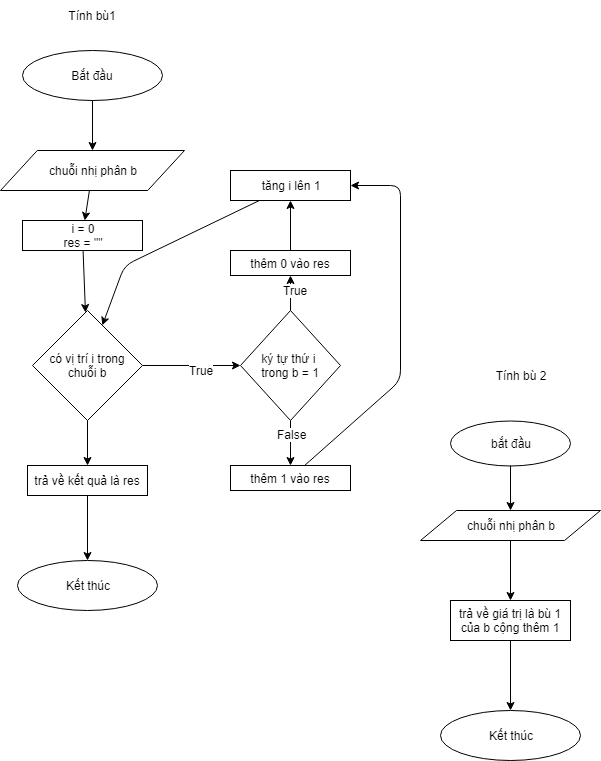

# Binary stuff

Bài cuối kỳ môn cấu trúc máy tính

### Công cụ

- jdk 8
- javafx
- scene builder
- intellij com

### Sử dụng

mở trực tiếp file BinaryStuff.jar hoặc import vào project

src/ -> source code

### Lưu đồ thuật toán

